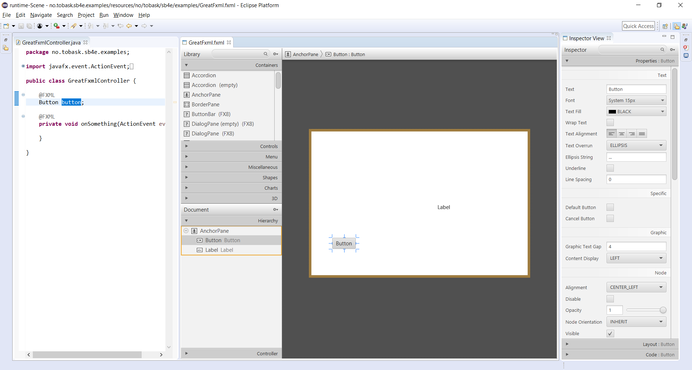
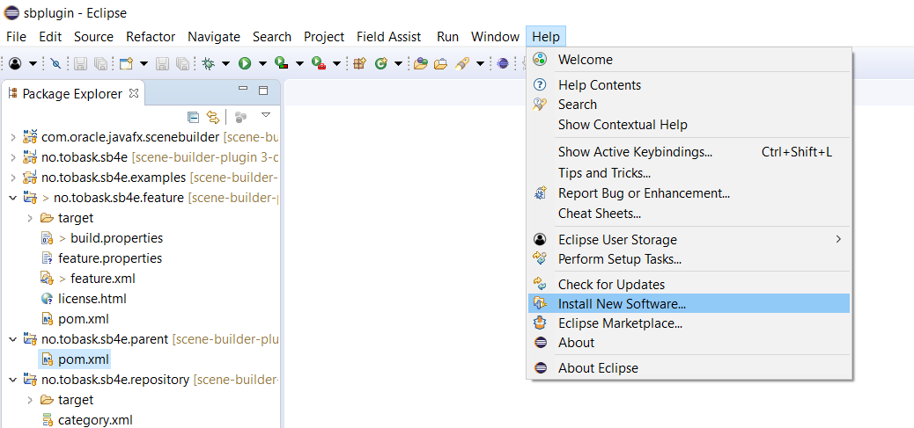
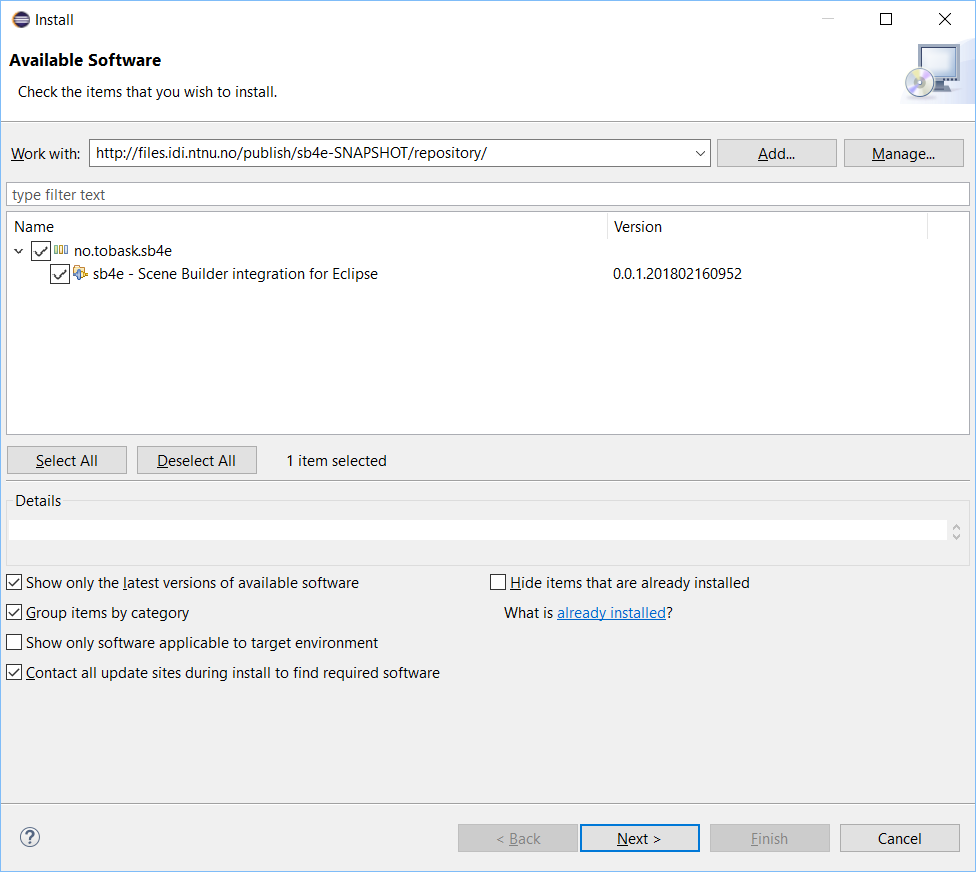
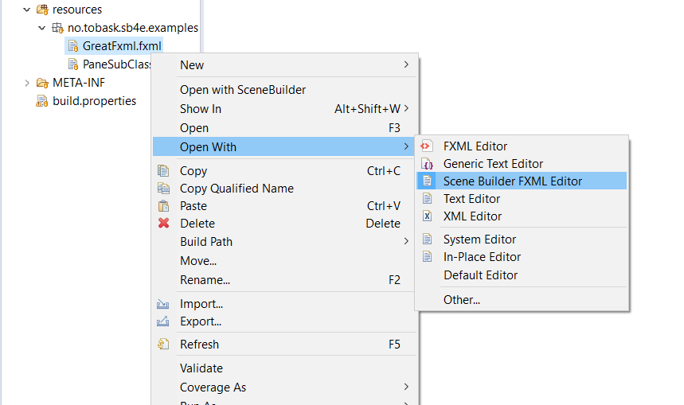
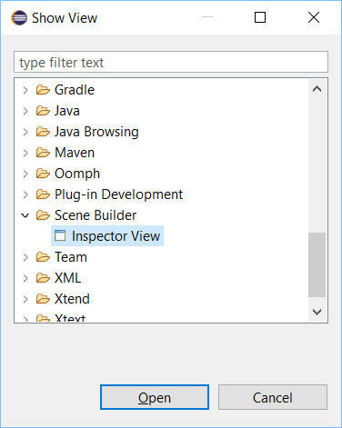
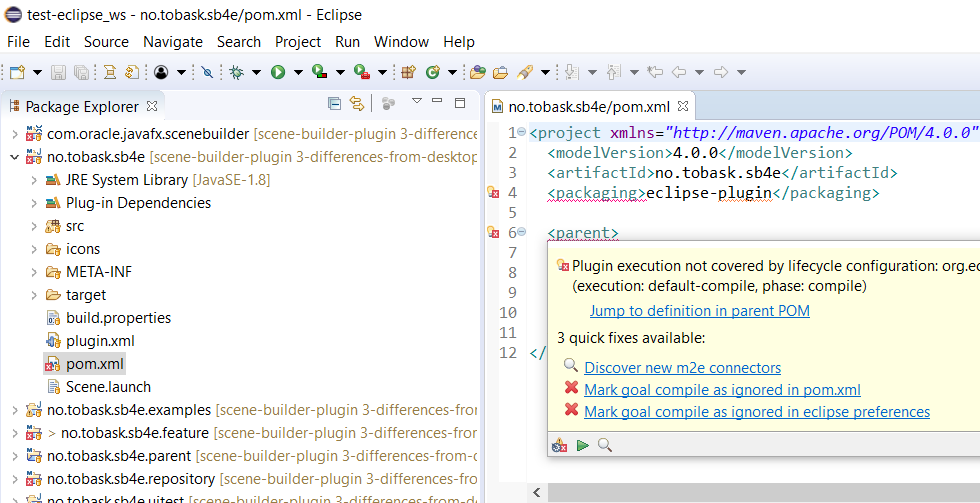
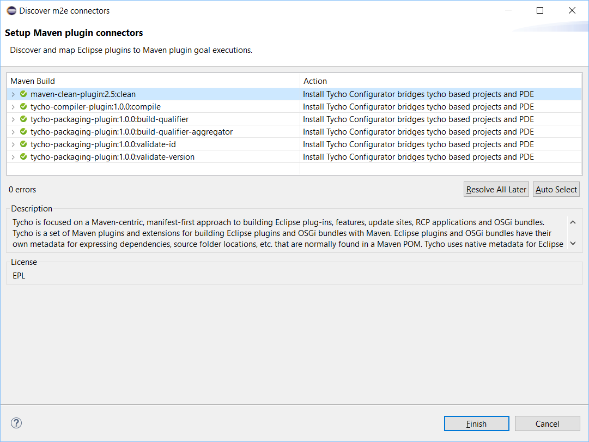
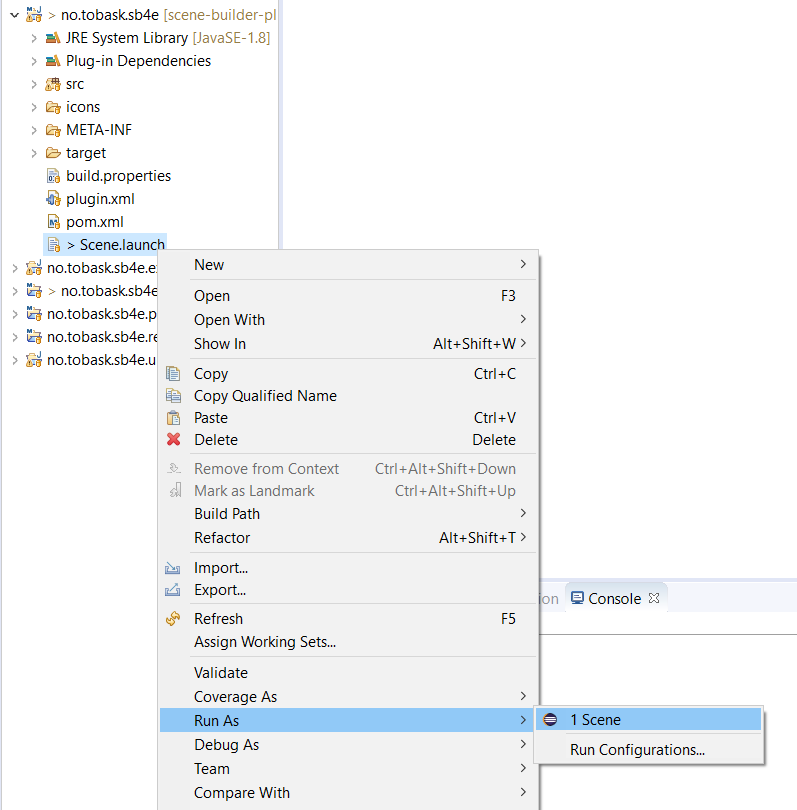

# sb4e
sb4e is an integration of [Scene Builder](http://gluonhq.com/products/scene-builder/), a tool for editing JavaFX user interfaces defined in FXML, into the Eclipse IDE. It extends Eclipse with functionality to edit FXML files directly from the IDE, using a drag & drop user interface.

## Installation

### Prerequisites

 - Java JDK 8
 - Eclipse
 - e(fx)clipse extension for Eclipse

### Installing
Extensions can be installed into Eclipse using the "Install New Software" wizard, accessible from the Help menu as shown below:

 

sb4e is hosted here on GitLab. Version 0.9 is available [here]( https://gitlab.stud.iie.ntnu.no/tobiaas/scene-builder-plugin/-/jobs/7997/artifacts/raw/sb4e.repository/target/repository/). The latest version is always available [here]( https://gitlab.stud.iie.ntnu.no/tobiaas/scene-builder-plugin/-/jobs/artifacts/master/raw/sb4e.repository/target/repository?job=integrationtest-job). Enter the URL in the "Work with" field of the wizard and press enter. sb4e should appear, perhaps after some time, as the only item. Check it, and follow the wizard until completion. A restart of Eclipse is needed when the installation is complete.

## Usage
Once sb4e is added to an Eclipse installation, two new components are available to you; an editor that opens FXML files in a drag & drop UI, and a view for editing the properties of the elements in the document. The editor, called "Scene Builder FXML Editor", is automatically added to Eclipse's list of editors registered as able to open files with .fxml extensions. 

The view, called "Inspector View", can be opened from the "Show View" wizard. It is found in the "Scene Builder" category. 

    
## Development setup
### Prerequisites
- Java JDK 8
- Eclipse installation with the following extensions:
	- e(fx)clipse
	- Eclipse PDE Plug-in Developer Resources
	- SWTBot for Eclipse Testing
	- Tycho Project Configurators (NOTE: these should not be installed using the "Install New Software" wizard. Instead, they should be discovered by Eclipse, as described below)
- Git

Clone the Git project with

    git clone https://gitlab.stud.iie.ntnu.no/tobiaas/scene-builder-plugin.git

and import it into Eclipse, preferably in an empty workspace. Eclipse will now try to build the projects, but will report some errors of the type "Maven Project Build Lifecycle Mapping Problem". To resolve these, open one of the affected POMs, navigate to the XML file, and hover the mouse over the error. Eclipse will suggest "Discover new m2e connectors" as a quick fix. Clicking this alternative, and following the wizard to completion, will install the correct Tycho project configurators. With these installed, all projects should build without issues.

### Running
Although it is possible to develop and run the plug-in in the same Eclipse, running it in a separate instance is much more convenient. Eclipse supports run configurations which launch Eclipse applications. sb4e ships with such a run configuration that is pre-configured. It is called "Scene.launch" and is located at the root of the sb4e project. To launch an Eclipse instance with sb4e freshly built and installed, right click the launch configuration -> "Run As" -> "1 Scene". Some example documents can be found in sb4e.examples, a project that can be imported into the runtime instance.
 

## Licenses 
sb4e is licensed under the [Eclipse Public License 2.0](https://www.eclipse.org/legal/epl-2.0/). [Scene Builder](http://gluonhq.com/products/scene-builder/) is licensed under the BSD license. 

## Acknowledgements
[Scene Builder](http://gluonhq.com/products/scene-builder/) is an awesome, open-source tool that greatly simplifies the design process of JavaFX GUIs. The source code is available at [Bitbucket](https://bitbucket.org/gluon-oss/scenebuilder), and is well worth having a look at, as it showcases the true strengths of applied object oriented principles.

[Hallvard Trætteberg](https://www.ntnu.no/ansatte/hal) is a brilliant Associate Professor at [NTNU](https://www.ntnu.no/), a university in Norway. The integration was his idea, and he has been guiding the project from the beginning. His areas of expertise include, among many things, Eclipse plug-in development, which is vital to the development of this project.